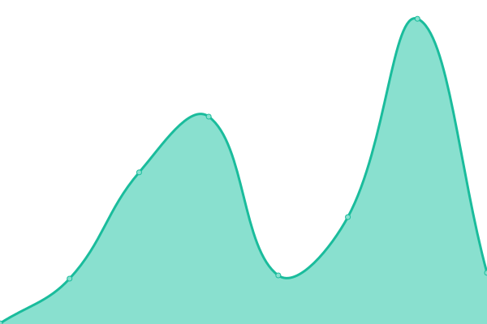

# [📈 Live Status](https://upptime.github.io/upptime): <!--live status--> **🟩 All systems operational**

This repository contains the open-source uptime monitor and status page for [Upptime](https://upptime.js.org), powered by [Upptime](https://github.com/upptime/upptime).

With [Upptime](https://upptime.js.org), you can get your own unlimited and free uptime monitor and status page, powered entirely by a GitHub repository. We use [Issues](https://github.com/upptime/upptime/issues) as incident reports, [Actions](https://github.com/flow-finance/lighthouse/actions) as uptime monitors, and [Pages](https://upptime.github.io/upptime) for the status page.

<!--start: status pages-->
<!-- This summary is generated by Upptime (https://github.com/upptime/upptime) -->
<!-- Do not edit this manually, your changes will be overwritten -->
<!-- prettier-ignore -->
| URL | Status | History | Response Time | Uptime |
| --- | ------ | ------- | ------------- | ------ |
|  [FlowFi.com](https://www.flowfi.com) | 🟩 Up | [flow-fi-com.yml](https://github.com/flow-finance/lighthouse/commits/HEAD/history/flow-fi-com.yml) | 

 368ms
     
 | 

<a href="https://flow-finance.github.io/lighthouse/history/flow-fi-com">100.00%</a>
    

|  [FlowFi App](https://app.flowfi.com) | 🟩 Up | [flow-fi-app.yml](https://github.com/flow-finance/lighthouse/commits/HEAD/history/flow-fi-app.yml) | 

 289ms
     
 | 

<a href="https://flow-finance.github.io/lighthouse/history/flow-fi-app">100.00%</a>
    

|  [Workbench](https://alpha.workbench.flowfi.com) | 🟩 Up | [workbench.yml](https://github.com/flow-finance/lighthouse/commits/HEAD/history/workbench.yml) | 

 268ms
     
 | 

<a href="https://flow-finance.github.io/lighthouse/history/workbench">100.00%</a>
    

<!--end: status pages-->

[**Visit our status website →**](https://upptime.github.io/upptime)

## 📄 License

- Powered by: [Upptime](https://github.com/upptime/upptime)
- Code: [MIT](./LICENSE) © [Upptime](https://upptime.js.org)
- Data in the `./history` directory: [Open Database License](https://opendatacommons.org/licenses/odbl/1-0/)
